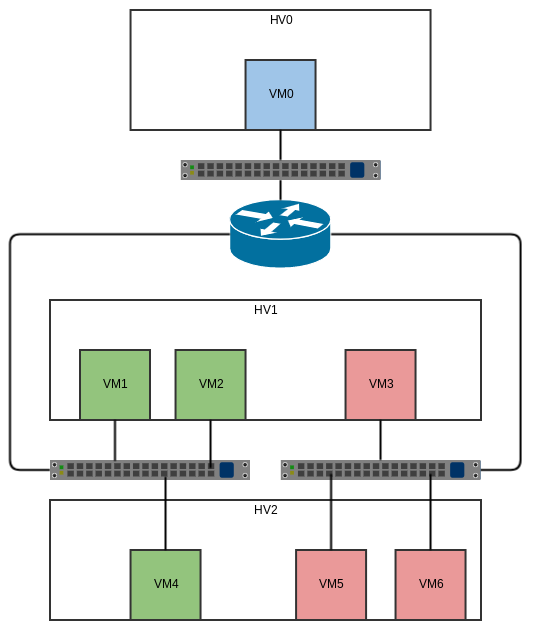

This is the baseline test. If this doesn't pass, then nothing else should even
attempt to run.

The following diagram illustrates the setup for this test:

The test will set up the above diagram and then query the north and southbound
databases to ensure that the contents match what we expect in key areas.

After that, pings are sent between each pair of VMs in the diagram (21 sets of
pings altogether). Pings should succeed in all cases.

After the upgrade, we again check the databases and re-issue the pings.
